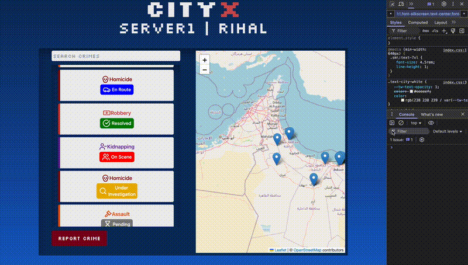
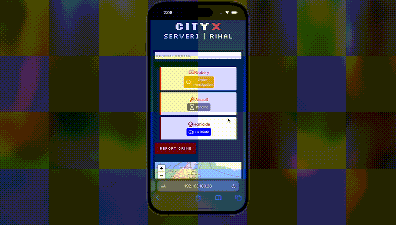
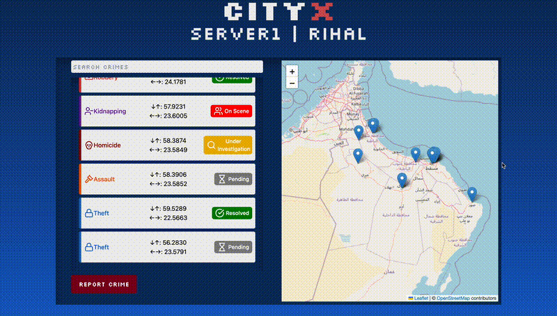
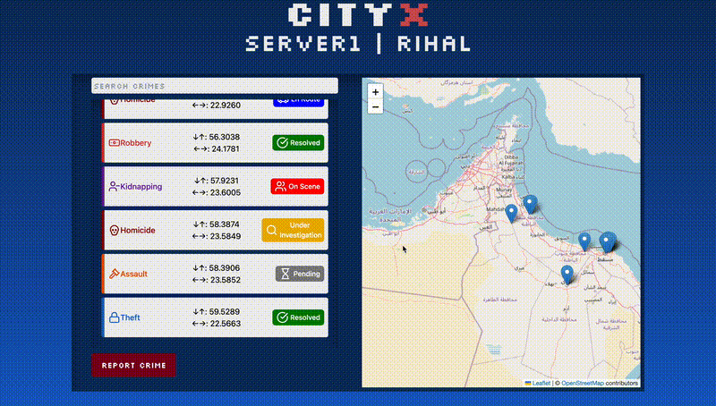
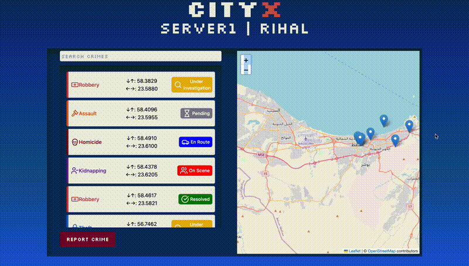

# Shadow Watch - CityX Crime Reporting System

A modern web application for reporting and tracking crimes in CityX. Built with React and featuring real-time map integration. This project was designed to protect CityX by enabling citizens to identify, locate, and report criminal activities within the city for prompt handling.

🌐 Live Demo: [https://shadow-watch.vercel.app](https://shadow-watch.vercel.app)

## Project Overview

Shadow Watch is a comprehensive crime reporting and tracking system that combines modern web technologies with user-friendly interfaces. The application enables citizens to report crimes, track their status, and view all reported incidents on an interactive map. Built with a focus on responsiveness and user experience, it works seamlessly across all devices.

## Key Features

### Core Functionality
- 🗺️ Interactive map interface for crime reporting and visualization
- 📝 Easy crime reporting system with map-based location selection
- 🔍 Dynamic search functionality for crimes (by ID, type, or date)
- 📊 Real-time crime status tracking with visual indicators

### User Experience
- 📱 Fully responsive design for all devices with no UI overlaps or glitches
- 🎨 Modern UI with intuitive crime type indicators and status badges
- 🎯 Click-to-focus functionality on crime locations from list view
- 💾 Local Storage support for persistent data across sessions
- 🔒 PWA (Progressive Web App) support for offline access

## Demo

### Desktop View

*The main interface showing the crime list and map view side by side*

### Mobile Responsiveness

*Seamless adaptation to mobile devices with optimized layout and touch interactions*

### Interactive Map Features

*Interactive map with crime markers, popups, and location selection*

### Crime Reporting Flow

*Step-by-step process of reporting a new crime with location selection*

### Search Functionality

*Real-time filtering of crimes by various criteria*

## Tech Stack

- **Frontend Framework**: React.js for dynamic UI components
- **Mapping**: Leaflet.js for interactive map integration
- **Styling**: Tailwind CSS for responsive and modern design
- **Data Persistence**: Local Storage for offline data management
- **UI Elements**: Lucide Icons for consistent and beautiful icons
- **Deployment**: Vercel for seamless hosting and deployment

## Getting Started

### Prerequisites

- Node.js (v14 or higher)
- npm (v6 or higher)

### Installation

1. Clone the repository:
```bash
git clone https://github.com/yourusername/shadow-watch.git
cd shadow-watch
```

2. Install dependencies:
```bash
npm install
```

3. Start the development server:
```bash
npm start
```

The application will be available at [http://localhost:3000](http://localhost:3000).

## Deployment

### Vercel Deployment

1. Install Vercel CLI (optional):
```bash
npm install -g vercel
```

2. Deploy to Vercel:
```bash
vercel
```

Alternatively, you can deploy directly through the Vercel dashboard:

1. Push your code to GitHub
2. Connect your repository to Vercel
3. Configure your project settings
4. Deploy!

### Manual Build

To create a production build:

```bash
npm run build
```

This will create an optimized production build in the `build` folder.

## Usage Guide

1. **View Crimes**: Browse all reported crimes on the interactive map
2. **Search Crimes**: Use the search bar to filter crimes by:
   - Crime ID
   - Crime type
   - Date and time
3. **Interact with Map**: 
   - Click crime cards to focus on their location
   - Zoom and pan the map
   - Click markers to view crime details
4. **Report Crimes**:
   - Click "Report Crime" button
   - Fill in crime details
   - Select location on the map
   - Submit the report

## Contributing

1. Fork the repository
2. Create your feature branch (`git checkout -b feature/AmazingFeature`)
3. Commit your changes (`git commit -m 'Add some AmazingFeature'`)
4. Push to the branch (`git push origin feature/AmazingFeature`)
5. Open a Pull Request

## License

This project is licensed under the MIT License - see the LICENSE file for details.

## Acknowledgments

- OpenStreetMap for providing map data
- React Leaflet for map integration
- Lucide Icons for the beautiful icons

## Author

Made with ♥️ by Hamzah AlNofli
